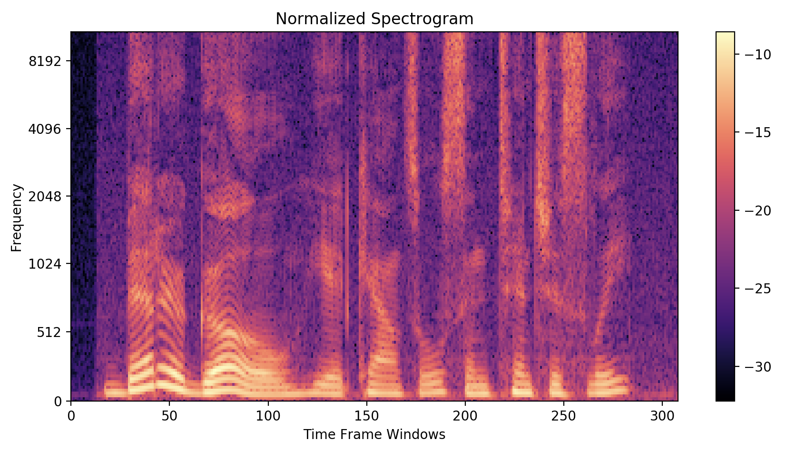

 

Imagine walking into a crowded, noisy restaurant - 

Well, these are still quarantine times, so this type of scenario is less common, but presumably, when life returns to normal, such a scenario could occur.

You sit across the table from your friend. It's noisy, with many other conversations going on around you, making it difficult to hear what she is saying.

## Cocktail Party Problem

The Cocktail Party Effect is the "ability for people to focus their auditory attention on one source,"[^1] whether that be a friend at a party, or a waiter in a restaurant. Humans, in general, are able to listen to mixed audio from many sources, and hone their focus on individual audio sources. 



However, this ability is not perfect: a listener may not necessarily pick up words and sounds only from the speaker of interest. The ability to "tune in" to a single voice is highly dependent on a number of features, including speaker pitch, location, rate of speech, and the listener's hearing capability. If a person only has one functional ear, or is hard of hearing, focusing on a single voice can be very difficult: with only one ear, it is difficult to determine locality of the speaker, and when hard of hearing, all sounds come through with limited fidelity.

So what if there was a way that we could make a device that could 'tune out' conflicting voices, listening only to the speaker of interest? Such a device would not only have to separate voices from a mixture, but also do it in a semi-real time fashion in order for it to be useful for day-to-day usage.

Let's start by looking into ways to accomplish voice separation.

## Separating Voice Mixtures

### Blind Source Separation

The traditional way to separate voices from a mixture is Blind Source Separation (BSS). "Blind" refers to the fact that the process by which the voices were mixed is unknown. BSS algorithms assume properties of the signal sources and the mixing processes, and then they use those assumptions to try to reconstruct the original audio.

One such algorithm is **Independent Component Analysis**, which requires that there are at least as many microphones as there are voices in the mixture, and relies on the assumption that the signals are non-Gaussian and independent.

The necessity for multiple microphones makes this algorithm particularly tricky, as the location of the mics and the hardware they are connected to can introduce phase delays that prevent the final audio samples from aligning properly.

Let us try an example of ICA to demonstrate this.

Microphones 1 and 2:
<audio controls>
<source src="assets/audio/ICA/mic_1.wav" type="audio/wav">Your browser does not support the audio element.</audio>

<audio controls>
<source src="assets/audio/ICA/mic_2.wav" type="audio/wav">Your browser does not support the audio element.</audio>

Recovered Sources:
<audio controls>
<source src="assets/audio/ICA/recon_source_1.wav" type="audio/wav">Your browser does not support the audio element.</audio>

<audio controls>
<source src="assets/audio/ICA/recon_source_2.wav" type="audio/wav">Your browser does not support the audio element.</audio> 

Evidently, not much unmixing was done.

### Neural Networks for Audio Separation

Artificial Neural Networks, or also referred to as neural networks, have proven to be very useful in a wide variety of tasks, including source separation. Neural networks, using large amounts of training data, can capture complex relationships that can be used for inference. In the case of source separation, a neural network can characterize how much of each audio slice belongs to each speaker.

Neural networks are not limited in the same way that BSS methods like ICA are: so long as the training data are representative of the testing data, there are fewer limitations on the properties of the original sources or the mixture.

>### _Aside: Spectrograms_
>
>
>A commonly used tool in the field of audio processing is the **spectrogram**, which is a 2D representation of an audio signal, generated using a Short Time Fourier Transform (STFT) with frequencies on one axis and time on the other. The color of each 'pixel' represents the intensity of a frequency at any given time. This transform allows us to see the individual frequency components of an sound clip. Conventional wisdom always said that spectrograms are _vital_ tools for source separation, as intuitively, separating the frequencies should assist with the separation process.
>
> However, in recent literature, it was found that neural networks could achieve very accurate results without performing the time-consuming STFT operation and its inverse.

We are using the _Convolutional Time Domain Audio Separation Network_ (Conv-TasNet)[^2] architecture, which is a network that operates solely in the time domain (see the appendix for more details), but is still able to produce relatively accurate results. We chose this network because we found it to be a fast neural network archictecture that still produced good results: lower latency of this network makes it more amenable to real time separation, even if the network does not achieve state of the art results.

Let's look at an example of a Conv-TasNet separating audio.

First, the raw audio:

<audio controls>
<source src="assets/audio/sx98_raw.wav" type="audio/wav">Your browser does not support the audio element.</audio>

<audio controls>
<source src="assets/audio/sable_raw.wav" type="audio/wav">Your browser does not support the audio element.</audio>

Next, we mix the two audio sources together:

<audio controls>
<source src="assets/audio/mixed-sable.wav" type="audio/wav">Your browser does not support the audio element.</audio>

Finally, we can run the audio through the network and generate two mixtures:

<audio controls>
<source src="assets/audio/mixed-sable_est1.wav" type="audio/wav">Your browser does not support the audio element.</audio>

<audio controls>
<source src="assets/audio/mixed-sable_est2.wav" type="audio/wav">Your browser does not support the audio element.</audio> 

The unmixed audio sounds very close to the original, save for some small artifacts in the left estimation when the speaker says the word "question" (headphones make it easier to hear this artifact). These high accuracy estimations show great promise for creating a source separation system using Conv-TasNet.

## Hardware and Real Time Considerations

### Hardware

A large focus in using deep learning for audio source separation lies in achieving the highest accuracy reconstructions. Separation is performed on machines with very powerful graphics cards, and the audio reconstructions are computed very quickly. However, in the field, it is not reasonable to expect that such a computer would be readily available.

The trade-off then becomes one of latency and computational speed: a more powerful computer is faster, but is impractical for deployment; a less powerful computer is slower, but more faithful to what would be available in the field.

We chose to focus on deploying a source separation pipeline to the [Nvidia Jetson Nano](https://developer.nvidia.com/embedded/jetson-nano-developer-kit), a single board computer which offers a compromise between computational power and portability. The Jetson Nano is similar to other single board computers like the [Raspberry Pi](https://www.raspberrypi.org/), except it comes with a more powerful on-board GPU that gives it an advantage when performing deep learning computations.

### Real Time Considerations

In many fields, real-time performance is a very difficult task, requiring each part of the input pipeline to be optimized to minimize latency. In the case of Conv-TasNet, the network relies on contextual data to perform separation, meaning it must operate on chunks of audio data. This means that even if the network performed inference instantaneously, there would still be a time delay of the chunk size at the output. Moreover, if the neural network cannot process the input audio faster than it is coming in, the latency will accumulate for every chunk and result in completely non-synced output. In essence, this becomes a [producer-consumer problem](https://en.wikipedia.org/wiki/Producer%E2%80%93consumer_problem).

Some options for alleviating these issues include:

 1. Using multiple processor cores to parallelize audio collection and neural network computation. This optimization is almost essential to prevent gaps in the recorded audio.
 2. Using optimization frameworks such as [TensorRT](https://developer.nvidia.com/tensorrt) to reduce model completexity and quantizing 
 3.  
 , using optimized frameworks for the Jetson Nano 

Some options for decreasing latency include: multithreading the python code, so audio can be recorded while the neural network performs computations, truncating the floating point precision to improve speed, and using a faster language, such as C++. We are currently in the process of experimenting with these optimizations.

### Results and Next Steps

As of now, we have implemented a multithreaded python program which is able to chunk the data and process it through the neural network; however, the program has a reconstruction error that results in choppy sounding audio. The effects of this reconstruction error can be mitigated by increasing the chunk size, but that in turn increases latency. 

On the one hand, we plan on investigating traditional reconstruction techniques to see if we can mitigate the choppiness. On the other, we also plan on training a neural network on data of the same length as our chosen chunk size, so that the training data is representative of our testing conditions.

In order to decrease latency, we are looking into the [ONNX standard](https://github.com/onnx/onnx) and [TensorRT](https://developer.nvidia.com/tensorrt), which should better optimize the neural network for fast compuation.
 
## Appendix: Conv-TasNet Architecture

Conv-TasNet has three stages: an encoder, a "separation module" which forms the masks, and a decoder. For starters, the encoder convolves the mixture waveform with a number of filters (512 in the original authors' implementation).

Moving onto the separation module, we note that it is the \\(T \times \text{enc\_dim}\\) encoding that is being masked, not the \\(T \times 1\\) signal, making it somewhat unconventional to call these masks "masks". As for how the masks are created, depthwise separable convolutions are used to form one \\(T \times \text{enc\_dim}\\) mask for each source, and the convolutions use exponentially increasing dilation factors to detect both short-term and long-term dependencies.

Lastly, the decoder performs a transposed convolution on each masked encoding, resulting in the separated sources, each with the same shape as the mixture waveform.

As for training, Conv-TasNet's objective is to maximize the scale-invariant signal-to-distortion ratio for each training example.

[^1]: [Edward Colin Cherry's Experiments](https://www.ee.columbia.edu/~dpwe/papers/Cherry53-cpe.pdf)

[^2]: [Conv-TasNet by Luo et al.](https://arxiv.org/pdf/1809.07454.pdf)
